# JagaSehat

JagaSehat adalah aplikasi Android untuk membantu keluarga mencatat dan memantau data kesehatan secara terstruktur. Aplikasi ini dikembangkan sebagai proyek mata kuliah Pemrograman Mobile.

## Tampilan Aplikasi

### Onboarding

<table>
  <tr>
    <td align="center">
      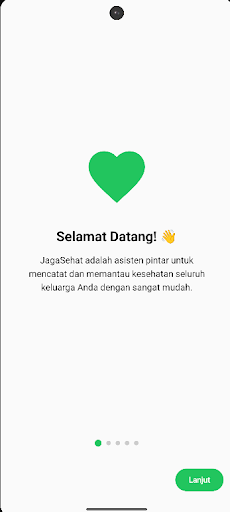<br>
      <b>Onboarding 1</b>
    </td>
    <td align="center">
      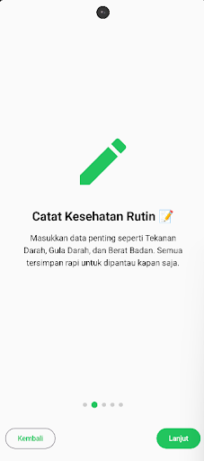<br>
      <b>Onboarding 2</b>
    </td>
    <td align="center">
      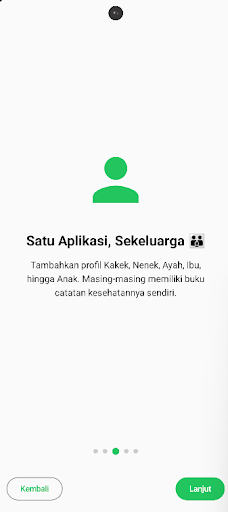<br>
      <b>Onboarding 3</b>
    </td>
  </tr>
  <tr>
    <td align="center">
      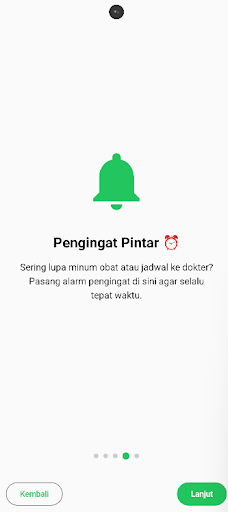<br>
      <b>Onboarding 4</b>
    </td>
    <td align="center">
      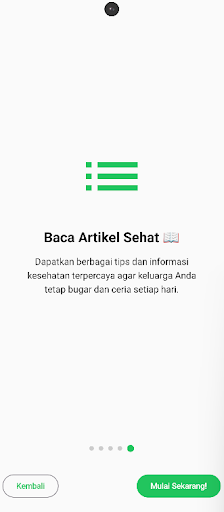<br>
      <b>Onboarding 5</b>
    </td>
    <td align="center">
      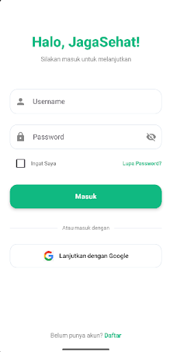<br>
      <b>Login</b>
    </td>
  </tr>
</table>

### Pengguna dan Data Keluarga

<table>
  <tr>
    <td align="center">
      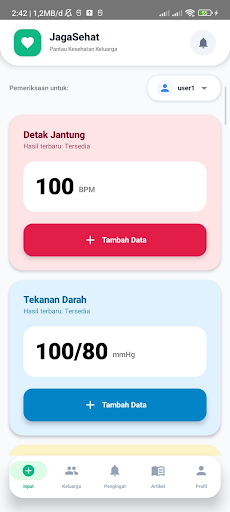<br>
      <b>Dashboard Pengguna</b>
    </td>
    <td align="center">
      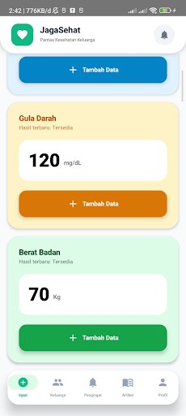<br>
      <b>Input Kesehatan</b>
    </td>
    <td align="center">
      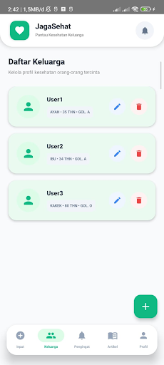<br>
      <b>Data Keluarga</b>
    </td>
  </tr>
</table>

### Pemantauan Kesehatan

<table>
  <tr>
    <td align="center">
      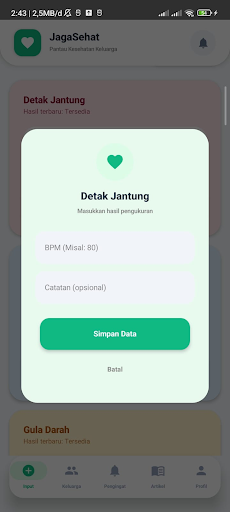<br>
      <b>Pencatatan Kesehatan</b>
    </td>
    <td align="center">
      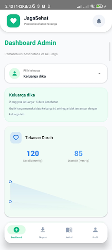<br>
      <b>Grafik Kesehatan per Keluarga</b>
    </td>
    <td align="center">
      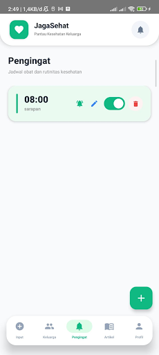<br>
      <b>Daftar Pengingat</b>
    </td>
  </tr>
  <tr>
    <td align="center">
      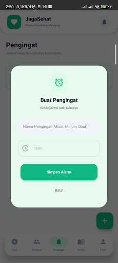<br>
      <b>Tambah Pengingat</b>
    </td>
    <td align="center">
      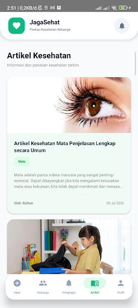<br>
      <b>Artikel Kesehatan</b>
    </td>
    <td align="center">
      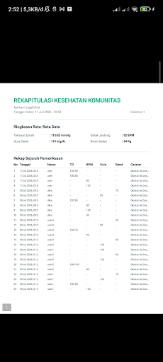<br>
      <b>Laporan PDF</b>
    </td>
  </tr>
</table>

## Fitur Utama

- Onboarding aplikasi
- Login dan registrasi pengguna
- Pengelolaan data anggota keluarga
- Pencatatan tekanan darah
- Pencatatan gula darah
- Pencatatan detak jantung
- Pencatatan berat badan
- Grafik pemantauan kesehatan per keluarga
- Pengingat kesehatan dan jadwal obat
- Notifikasi pengingat
- Artikel dan informasi kesehatan
- Pengelolaan artikel oleh admin
- Ekspor laporan dalam format PDF
- Ekspor data dalam format TXT
- Pengaturan profil pengguna
- Penyimpanan data lokal menggunakan Room Database

## Peran Pengguna

### User Biasa

Pengguna biasa dapat:

- Mengelola data anggota keluarga
- Mencatat data kesehatan keluarga
- Melihat hasil pemantauan kesehatan
- Membuat pengingat
- Membaca artikel kesehatan
- Mengelola profil

### Admin

Admin dapat:

- Melihat data kesehatan pengguna
- Melihat grafik kesehatan berdasarkan keluarga
- Mengelola artikel kesehatan
- Mengekspor rekap data kesehatan
- Memantau data yang tersimpan dalam aplikasi

## Teknologi yang Digunakan

- Kotlin
- Android Studio
- Jetpack Compose
- Material 3
- Room Database
- Kotlin Coroutines dan Flow
- Navigation Compose
- KSP
- Android AlarmManager
- iText PDF
- Coil
- Gradle Kotlin DSL

## Struktur Proyek

```text
app/
├── src/main/java/
│   └── com/example/jagasehat/
│       ├── data/
│       ├── model/
│       ├── navigation/
│       ├── receiver/
│       ├── repository/
│       ├── ui/
│       ├── utils/
│       ├── viewmodel/
│       └── MainActivity.kt
├── src/main/res/
└── build.gradle.kts

gradle/
build.gradle.kts
settings.gradle.kts
gradle.properties
